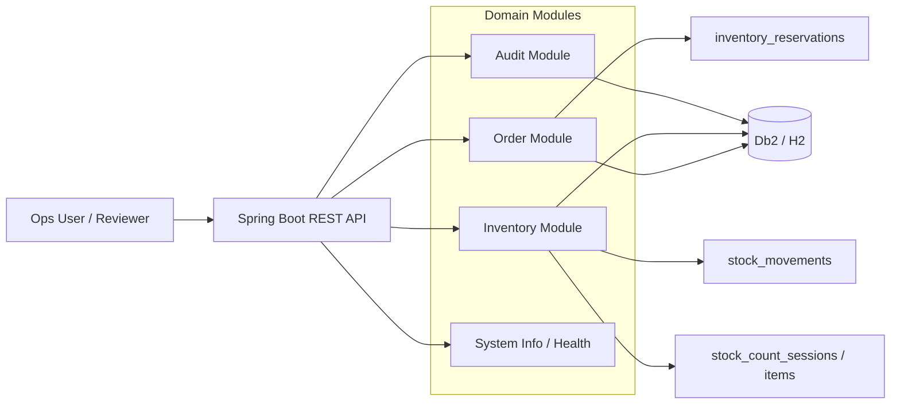

# Architecture Overview

## System Intent

This project models a small but realistic operational backbone for a distributor or industrial supplier.

Primary concern:

- do not over-promise inventory

Secondary concerns:

- keep reservation state explicit
- preserve shipment traceability
- reconcile inventory drift after physical counts
- audit who changed what and when

## Actors

- `Sales Ops`: creates and confirms sales orders
- `Warehouse Ops`: reserves stock, ships items, and performs cycle counts
- `Operations Manager`: monitors exceptions and reviews audit history

## High-Level Design

## Core Architectural Choices

### 1. Current state plus ledger

The model keeps both:

- `inventory_balances` for fast current-state reads
- `stock_movements` for append-only history

That allows the application to answer operational questions quickly without losing the history needed for audit or investigation.

### 2. Explicit reservations

Reservations are first-class records, not just numbers hidden inside order rows.

That is important because:

- one order can reserve from a specific warehouse
- shipments consume reserved stock
- cancellations release only the remaining reserved quantity
- partial fulfillment stays traceable

### 3. Reconciliation as an operational event

Cycle counts are modeled as sessions with line items. Reconciliation posts inventory adjustments rather than overwriting history silently.

This means the system can surface exception states such as negative available quantity instead of hiding them.

### 4. Honest deployment boundary

The project is IBM-first in design and validation, but it does not over-claim infrastructure that was not actually provisioned.

Current truth:

- live `Db2` validation was completed locally in Docker
- containerized runtime and `IBM Cloud Code Engine` deployment scripts exist
- paid cloud `Db2` deployment depends on account plan availability

## Runtime Modes

### Local developer mode

- profile: `local`
- database: in-memory `H2`
- purpose: fast startup and test execution

### Db2 validation mode

- profile: `db2`
- database: local Docker `Db2`
- purpose: prove schema, Flyway migrations, and runtime mappings against live Db2

### Containerized stack mode

- backend Docker image built from the project `Dockerfile`
- Db2 runtime started through Compose
- purpose: verify the app can boot, migrate, and report healthy when containerized

## What This Project Proves

- relational modeling for a transactional domain
- separation of current state and immutable history
- consistent reservation and shipment semantics
- Flyway-managed schema lifecycle
- framework-level validation on both `H2` and live `Db2`
- readiness for cloud deployment without pretending that cloud deployment already happened

## What It Does Not Try To Prove

- zero-downtime production migration strategy
- multi-region disaster recovery
- advanced procurement or demand forecasting
- complex event-driven decomposition

The current scope is intentionally smaller so the core backend decisions remain visible and defendable.
