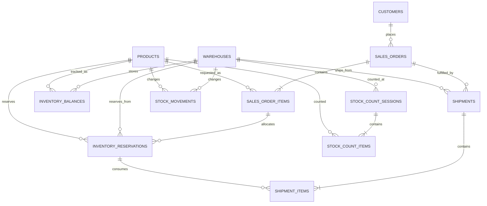

# ERD And Data Rules

This ERD covers the MVP flow:

`sales order -> reserve stock -> ship partially/fully -> count stock -> reconcile variance`

## Entity Relationship Diagram

`AUDIT_LOGS` is polymorphic by design and can point to any business entity through `entity_type + entity_id`.

## Why The Model Looks Like This

- `inventory_balances` is the current-state table.
- `stock_movements` is the append-only ledger for inventory changes.
- `inventory_reservations` makes allocation explicit instead of hiding it inside order items.
- `shipment_items` consumes a specific reservation so partial fulfillment remains traceable.
- `stock_count_sessions` and `stock_count_items` separate the count event from each counted SKU.

## Core Invariants

- `available-to-promise = on_hand_qty - reserved_qty`
- Reservation creation must never push `available-to-promise` below zero
- Every inventory-changing action must create a `stock_movement`
- Reservation consumption and release must never exceed the originally reserved quantity
- `stock_movements` should be treated as immutable after insert
- Order, reservation, shipment, and count status changes should also generate `audit_logs`

`reserved_qty > on_hand_qty` is still allowed after a reconciliation adjustment. That is not a normal allocation state, but it is a useful exception state because it exposes over-commitment instead of hiding it.

## Inventory Movement Semantics

`stock_movements` stores two deltas:

- `on_hand_delta`
- `reserved_delta`

Examples:

- `RESERVE`: `on_hand_delta = 0`, `reserved_delta = +N`
- `RELEASE`: `on_hand_delta = 0`, `reserved_delta = -N`
- `SHIP`: `on_hand_delta = -N`, `reserved_delta = -N`
- `COUNT_ADJUST_INCREASE`: `on_hand_delta = +N`, `reserved_delta = 0`
- `COUNT_ADJUST_DECREASE`: `on_hand_delta = -N`, `reserved_delta = 0`

This is stricter than a single `qty_delta` column and makes reservation math auditable.

## Reservation Lifecycle

1. A confirmed order item can create one or more `inventory_reservations`.
2. Reservations are warehouse-specific.
3. A shipment consumes reserved quantity from one reservation at a time.
4. If an order is reduced or cancelled, remaining reserved quantity is released.
5. A reservation is effectively closed when:
   - `consumed_qty + released_qty = reserved_qty`

## Count And Reconciliation Lifecycle

1. `stock_count_sessions` defines the warehouse and the time window.
2. `stock_count_items` stores the system quantity, counted quantity, and variance per SKU.
3. If variance is non-zero, the application posts a corresponding `stock_movement`.
4. The count item then moves to `RECONCILED`.

After a downward count adjustment, `available-to-promise` may become negative. The dashboard should surface that as an operational issue to resolve, not silently clamp it away.

## Suggested Review Order

For early feedback from a Db2-oriented reviewer, validate these parts first:

- Quantity precision: whether `DECIMAL(18,3)` is right for the domain
- Status models and whether they are too strict or too loose
- Indexes for reservation lookup and movement history
- Whether count adjustments should use a separate reconciliation table in V2
